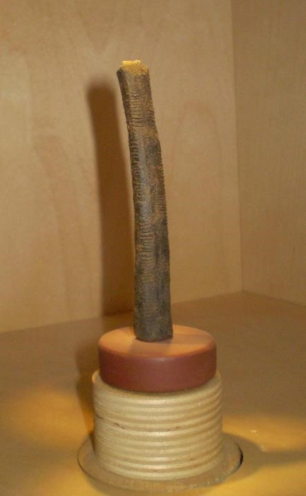
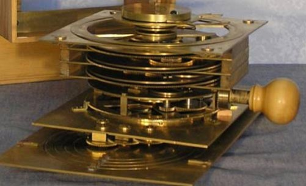
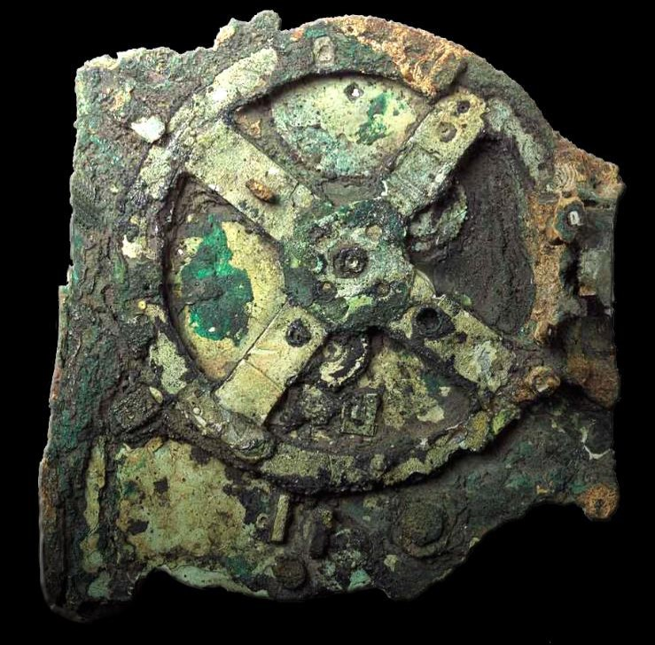

# A Brief History of computing

## Computing Timeline
|     Dates    | Developments                                                                                                                                   |
|:------------:|------------------------------------------------------------------------------------------------------------------------------------------------|
| 20,000 BCE   | Early cultures develop counting and rudimentary record-keeping                                                                                 |
| 150-100 BCE  | Antikythera Mechanism - analog computing device                                                                                                |
| Up to 1800s  | Algebra developed. Algorithms developed and used. Abacus invented and used. First mechanical calculators built and used.                       |
| 1800-1930    | Babbage's Difference Engine. Boolean Logic. Hollerith, punch cards, and the 1890 census                                                        |
| 1930s        | Alan Turing's papers on computability. Claude Shannon and information theory.                                                                  |
| 1940s        | First electronic digital computers - Colossus, ENIAC, etc                                                                                      |
| 1950s        | Symbolic programming languages. Transistors. Data-processing applications (spreadsheets, etc).                                                 |
| 1960-1975    | Integrated circuits. Minicomputers. Time-sharing mainframe systems. Keyboards and monitors. Grace Hopper, compilers, and high-level languages. |
| 1975-1990    | Microcomputers. Mass-produced personal computers. GUIs. Networks and Internet                                                                  |
| 1990s        | Optical storage. World Wide Web. Laptop computers                                                                                              |
| 2000-present | Embedded computing. Wireless computing. Continuing proliferation of the web into every facet of human life.                                    |

## The Early Years

Computational reasoning is not by any stretch a uniquely human trait. Many animals have been shown to, at the very least, add and subtract even if at a very rudimentary level. Of course, no other animal has taken the whole thing quite so far as humans. The digital computer has been in development for a very long time. In fact, the earliest computation and data storage devices go back as far as the earliest humans on Earth.

The **Ishango Bone** is a section of a babboon's femur which has curious notches carved into its surface. The prevailing theory is that it was a counting device, though, as you can probably imagine, many an anthropologist have poured countless hours of fruitless speculation into just what the hatchmarks could possibly be counting. Suffice to say, it is a very early example showing that basic anal retentive record-keeping goes back quite a long way in human history.

  

The **Antikythera Mechanism** is fascinating for so many reasons. For one, it is a magnificent work of art all on its own. Used to calculate the positions of the stars to aid in navigation, it is not only notable for its capabilities or early date (150 BCE), but for its staggering complexity. For while there are no other examples of the mechanism in existence, it is fairly easy to reason that no such device could have sprung up fully formed. There had to have been a progression of less complex versions and it almost certainly had contemporaries, even if only a few.

The **abacus** was an still is one of the most useful ancient arithmetic machines. In fact, it is still in use by some people in Eastern Europe, Russia, China, and Africa. It never needs to charge its batteries and it never needs security updates.

**Algebra**'s earliest roots go back to the Babylonians and many forms of algorithmic computation (or evidence of it) popped up in places all over the world from Hellenic Greece to Egypt to South America. But it was a Persian mathematician named *Omar Khayyam* who laid the foundations for algebraic geometry in 1070. European Algebra got a kick in the pants when an Italian mathematician named Fibonacci revived European algebra in the 13th century.

**[Charles Babbage](https://en.wikipedia.org/wiki/Charles_Babbage)** and **[Ada Lovelace](https://en.wikipedia.org/wiki/Ada_Lovelace)** are interesting figures in the history of computing, though in the end, their actual effect on the future trajectory of the study of algorithmic computing is probably pretty negligible. Most of their work occurred during 1830s. They get lots of credit for some of their ideas though, even if they never saw the light of day until very recently. Babbage designed a device that he called the *Difference Engine* which was a complex mechanical machine with over 18,000 parts which could be used to solve polynomial equations. It was, however, never built. Ada Lovelace, the daughter of the Romantic poet Lord Byron and a brilliant mathematician, had a correspondence with Babbage and, after seeing his plans for the Difference Engine, developed what is widely regarded as the first computer program, an algorithm which the Difference Engine could use to calculate the sequence of [Bernoulli numbers](https://en.wikipedia.org/wiki/Bernoulli_number).

The next really significant development in the progress of computing machines happened in the years leading up to the 1890 census. A man named Herman Hollerith invented an electromechanical punch card tabulating machine which cut the processing time from 8 years (the 1880 census) to only six in 1890. This is made significant especially considering how much larger the population had grown over those ten years. Hollerith went on to found a company called *The Tabulating Machine Company*, which eventually merged with three other companies to become the *Computing-Tabulating-Recording Company* (CTR). In 1924, CTR was renamed to the much more familiar *International Business Machines Corporation* or IBM.

Along comes perhaps the most famous computer scientist of all time, [Alan Turing](https://en.wikipedia.org/wiki/Alan_Turing). He is perhaps most famous for his work at Bletchley Park cracking the German Enigma Code during World War II. However, he also laid down considerable theoretical groundwork for the field of computer science such that he is often regarded as the father of theoretical computer science.
